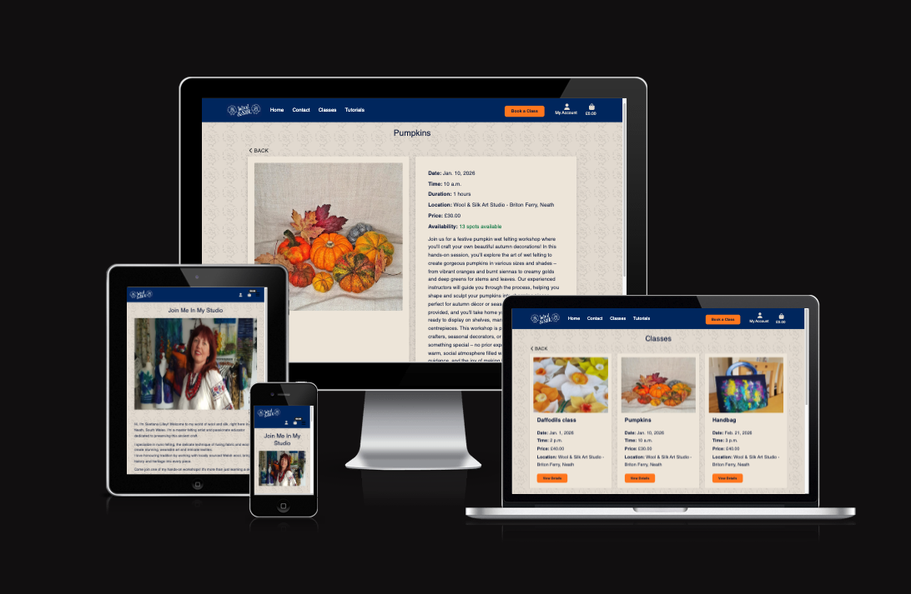

# Wool & Silk Art Studio



View live website [HERE](https://wool-and-silk-2e22b8061ad1.herokuapp.com)

Project Dashboard [HERE](https://github.com/users/Anastasiya-m4c/projects/5/views/1)

## About

**Wool & Silk Art Studio** Wool & Silk Art Studio is an e-commerce platform I built for my mum, Svetlana Lilley, and her wet felting art studio in Briton Ferry, Neath, South Wales. The site allows her students to browse, book, and pay for felting classes while discovering the beautiful art of working with wool and silk.  

The inspiration for Wool & Silk came from watching my mum pour her heart into her craft and wanting to give her a professional online home that truly represents her work. As a master felting artist specializing in nuno felting and working with locally sourced Welsh wool, she needed more than just a website—she needed a platform that captured the warmth and creativity of her studio while making it easy for students to join her classes. This project became my way of supporting her passion and helping her small business thrive.  

Built with **Django** and designed to be fully responsive and mobile-friendly, Wool & Silk offers a seamless experience for both my mum and her students, no matter what device they're using.  

---

## Table Of Contents:

1. [Design & Planning](#design--planning)
   - [User Stories](#user-stories)
   - [Wireframes](#wireframes)
   - [Typography](#typography)
   - [Colour Scheme](#colour-scheme)
2. [Features](#features)
   - [User Features](#user-features)
   - [Security Features](#security-features)
3. [Data Schema](#data-schema)
4. [Technologies](#technologies)
   - [Languages Used](#languages-used)
   - [Frameworks, Libraries and Programmes Used](#frameworks-libraries-and-programmes-used)
5. [Testing](#testing)
6. [Bugs](#bugs)
7. [Deployment](#deployment)
8. [Credits](#credits)

---

## Overview

Wool & Silk Art Studio is a full-stack e-commerce application built with Django. The platform showcases wet felting classes taught by master felting artist Svetlana Lilley, who specializes in nuno felting and working with locally sourced Welsh wool.

### Project Goals

- Provide an intuitive booking system for felting classes

---

## User Experience (UX)

### Target Audience

- **Craft enthusiasts** looking to learn felting techniques
- **Beginners** interested in textile arts
- **Experienced artists** wanting to master nuno felting
- **Local residents** in South Wales seeking creative workshops
- **Gift buyers** looking for unique experience gifts

### User Stories

# Wool & Silk User Stories

## Accounts & Authentication
- As a visitor, I want to create an account so that I can book classes and access tutorials.
- As a registered user, I want to log in/out securely so that I can access my purchases.
- As a user, I want to manage my profile (name, email, preferences) so I can keep my account up to date.

## In-Person Classes
- As a visitor, I want to view a list of upcoming in-person classes so I can decide what to attend.
- As a user, I want to view details of a class (date, time, location and price) so I can choose the right one for me.
- As a user, I want to book and pay a deposit for a class so I can secure my spot.
- As a user, I want to see my booked classes in my profile so I don't forget.

## Payments & Subscription
- As a user, I want to pay securely online (Stripe) so I feel confident using the site.
- As an admin, I want to manage prices and products so I can update offers quickly.

## Testimonials
- As a visitor, I want to read testimonials from other customers so I feel reassured about the quality of classes.
- As a user, I want to submit a testimonial after taking a class/tutorial so I can share my experience.
- As an admin, I want to moderate testimonials so I can control what gets published.

## Enquiries / Contact
- As a visitor, I want to fill in a contact/enquiry form so I can ask about classes or tutorials.
- As a user, I want to receive a confirmation email after submitting an enquiry so I know it went through.
- As an admin, I want to receive enquiries in my dashboard or by email so I can respond.

## Content & Navigation
- As a visitor, I want to see an attractive homepage with Wool & Silk's brand and offerings so I understand what's available.
- As a visitor, I want to view list and individual product.

## Admin & Management
- As an admin, I want to create, edit, and delete in-person classes so I can keep the schedule updated.
- As an admin, I want to upload/manage video tutorials so I can grow the library.
- As an admin, I want to view enquiries so I can manage operations smoothly.

### Space Allocation & Overbooking Prevention
- As an admin, I want to set a maximum capacity for each class so the system prevents overbooking automatically.
- As an admin, I want to see real-time availability counts so I can monitor bookings and prevent overselling.
- As an admin, I want the system to block new bookings when capacity is reached so customers cannot purchase unavailable spots.
- As an admin, I want to adjust class capacity after creation so I can respond to venue or resource changes.

### Waiting List
- As a customer, I want to join a waiting list when a class is full so I have a chance to attend if spots open up.

---

## Future Developments

- **Tutorials Section:** Video content for learning felting techniques at home. The tutorial app has bee creating with coming soon messaging to promote this to existing user base.  
- **Multiple Images per Class:** Gallery view for each class showing examples
- **Blog:** Tips, techniques, and studio news
- **Newsletter Signup:** Email marketing integration for updates
- **Gift Vouchers:** Purchasable class vouchers for gifts
- **Workshop Calendar:** Interactive booking calendar view
- **Social Media Integration:** Direct sharing to Instagram and Facebook
- **Admin Dashboard:** So that admin cal easliy see upcoming classes and a number of bookings and attendees for each.  


---

## Wireframes

This site is designed to be clean, welcoming, and easy to navigate, reflecting the creative and approachable nature of the studio.

Wireframe images ()

[Deployed on Heroku](https://wool-and-silk-2e22b8061ad1.herokuapp.com)

Final MVP version:

[Finall website images]
(staticfiles/images/readme_images/home.png)
(staticfiles/images/readme_images/testimonials_carousel.png)
(staticfiles/images/readme_images/testimonials.png)
(staticfiles/images/readme_images/testimonials_admin.png)
(staticfiles/images/readme_images/shopping_bag.png)
(staticfiles/images/readme_images/shopping_bag_2.png)
(staticfiles/images/readme_images/profile.png)
(staticfiles/images/readme_images/classes.png)
(staticfiles/images/readme_images/edit_class.png)
(staticfiles/images/readme_images/availibility.png)
(staticfiles/images/readme_images/fully_booked.png)
(staticfiles/images/readme_images/tutorials.png)
(staticfiles/images/readme_images/checkout.png)
(staticfiles/images/readme_images/privacy_policy.png)
(staticfiles/images/readme_images/mobile_nav.png)
(staticfiles/images/readme_images/footer.png)
(staticfiles/images/readme_images/404.png)


---

## Typography

For the Wool & Silk website, the fonts chosen are **Bodoni Moda** and **Merriweather**, both elegant serif fonts that convey artistry and craftsmanship. Bodoni Moda is used for headings, providing a sophisticated and timeless feel, while Merriweather ensures excellent readability for body text across all devices.

This typography choice balances professionalism with warmth, reflecting the artistic nature of felting while maintaining a welcoming and trustworthy experience for users.

---

## Colour Scheme & Logo

The color scheme for Wool & Silk has been carefully selected to reflect the creative, warm, and playful nature of the studio. As my mum is partially sighted, good contrast and visibility are very important considerations in the design. The palette features vibrant blues, corals, yellows, and turquoise, inspired by the colorful nature of felted wool and the cheerful sheep mascot that represents the studio.

**Color Palette:**
- **Primary Blue (#002b68):** Trust and creativity
- **Light Blue (#3EA8C2):** Calm and trust
- **Orange (#FF8120):** Energy and inspiration
- **Cinnamon (#FF5B3C):** Warmth and approachability
- **Yellow (#rgb(255, 191, 40)):** Joy and optimism

The colors ensure strong contrast while creating a cohesive, vibrant brand identity. This thoughtfully curated palette supports an intuitive user experience, keeping focus on the classes and studio offerings.

---

## Features

### User Features

- User registration and authentication with email verification via Django Allauth
- Full CRUD functionality for classes (admin only)
- Browse classes with images, descriptions, dates, and pricing
- Add classes to shopping bag with quantity selection
- Secure checkout with Stripe payment integration
- Save profile information for faster checkout
- View order history in user profile
- Submit testimonials with star ratings (purchase required)
- Admin approval system for testimonials before public display
- Contact form with email notifications to studio owner
- Testimonials carousel on homepage
- Pagination for browsing classes
- Responsive design ensuring usability across all devices
- Toast notifications for user feedback on actions
- Custom 404 error page
- Privacy Policy
- Shopping bag preview in toast messages
- Order confirmation emails
- Class capacity management - set and edit max attendees per class
- Waiting Lists


### Security Features

Security has been carefully considered throughout the design and development of this e-commerce platform to protect both users and sensitive data. Key security measures include:

- **User Authentication and Authorization:** The application uses Django's built-in authentication system, enhanced with `django-allauth` for secure user registration, login, and email verification. Certain actions such as adding, editing, or deleting classes are restricted to superuser accounts only.

- **Ownership Verification:** Users can only edit their own profile information and view their own order history. Testimonials are linked to user accounts and can only be submitted by customers who have made a purchase.

- **Secure Payment Processing:** All payment data is handled by Stripe and never stored on the server. The application uses Stripe's secure payment intent API with webhook verification.

- **Secure Secret Management:** Sensitive data such as secret keys, database URLs, Stripe keys, and AWS credentials are managed through environment variables and not hard-coded.

- **CSRF Protection:** Django's built-in CSRF protection is enabled on all forms.

- **Webhook Signature Verification:** Stripe webhooks are verified using signature authentication to ensure they originate from Stripe.

- **Admin Approval for Testimonials:** Testimonials require admin approval before being published, ensuring content quality and preventing inappropriate submissions.

---

## Data Schema

### Entities and Attributes

- **User** (Django built-in)
  - id (Primary Key)
  - username
  - email
  - password

- **Class**
  - id (Primary Key)
  - name
  - description
  - price (DecimalField)
  - image (ImageField)
  - start_date (DateField)
  - start_time (TimeField)
  - duration (IntegerField - hours)
  - location (CharField)
  - number of available spaces

- **Order**
  - id (Primary Key)
  - order_number (CharField - 8 chars, UUID-based)
  - user_profile (ForeignKey to UserProfile)
  - full_name (CharField)
  - email (EmailField)
  - phone_number (CharField)
  - country (CountryField)
  - postcode (CharField)
  - town_or_city (CharField)
  - street_address1 (CharField)
  - street_address2 (CharField)
  - date (DateTimeField)
  - order_total (DecimalField)
  - original_bag (TextField - JSON)
  - stripe_pid (CharField)

- **OrderLineItem**
  - id (Primary Key)
  - order (ForeignKey to Order)
  - product (ForeignKey to Class)
  - quantity (PositiveIntegerField)
  - lineitem_total (DecimalField - calculated)

- **UserProfile**
  - id (Primary Key)
  - user (OneToOneField to User)
  - default_full_name (CharField)
  - default_email (EmailField)
  - default_phone_number (CharField)
  - default_street_address1 (CharField)
  - default_street_address2 (CharField)
  - default_postcode (CharField)
  - default_town_or_city (CharField)
  - default_country (CountryField)

- **ContactMessage**
  - id (Primary Key)
  - name (CharField)
  - email (EmailField)
  - phone (CharField)
  - subject (CharField)
  - message (TextField)
  - created_at (DateTimeField)

- **Testimonial**
  - id (Primary Key)
  - user (ForeignKey to User)
  - title (CharField)
  - content (TextField)
  - rating (IntegerField - choices 1-5)
  - is_approved (BooleanField)
  - created_at (DateTimeField)

### Relationships

- A **User** can have one **UserProfile** (One-to-One)
- A **User** can create multiple **Orders** (One-to-Many)
- A **User** can create one **Testimonial** (One-to-Many with business rule)
- An **Order** can have multiple **OrderLineItems** (One-to-Many)
- A **Class** can appear in multiple **OrderLineItems** (One-to-Many)

---

## Technologies

### Languages Used

- **HTML5** - To create site structure
- **CSS** - To create custom styles
- **JavaScript** - For interactivity and Stripe integration
- **Python** - Backend logic and Django framework
- **Markdown** - To create README file

### Frameworks, Libraries and Programmes Used

- **Django 5.2.6** - The web framework used to develop the full-stack application
- **Bootstrap 5.0.2** - CSS framework for responsive design
- **jQuery 3.5.1** - JavaScript library for DOM manipulation
- **Font Awesome** - For icons throughout the site
- **Google Fonts** - For custom typography (Bodoni Moda, Merriweather)
- **Stripe** - Payment processing integration
- **AWS S3** - Cloud storage for static and media files
- **Heroku** - Cloud platform for hosting and deployment
- **GitPod/VS Code** - To develop the project and organize version control
- **Git/GitHub** - Version control and code repository
- **Chrome DevTools** - For debugging and testing
- **Lighthouse** - For performance testing
- **Favicon.io** - To create favicon
- **ChatGPT** - For generating content, documentation assistance & troubleshooting.

### Installed Django Apps & Libraries

- `django-allauth` - User authentication and social login
- `crispy-forms` and `crispy-bootstrap5` - Improved form styling
- `django-countries` - Country field for addresses
- `django-storages` - S3 integration for file storage
- `boto3` - AWS SDK for Python
- `Pillow` - Image processing
- `Stripe` - Payment processing
- `Gunicorn` - WSGI HTTP server for production
- `Psycopg2` - PostgreSQL database adapter
- `Whitenoise` - Static file serving (development)

---


## Testing

Throughout the development of this project, I have conducted several rounds of testing to ensure a smooth user experience, robust functionality, and adherence to web standards. Testing covered browser compatibility, accessibility, functionality, real device testing, and UI/UX design through a combination of manual testing, code validators, and tools like Lighthouse.

Full testing file can be found in [TESTING.md](TESTING.md).

## Deployment

The site was deployed to Heroku using the following method:

1. **Create and activate a virtual environment:**
   ```bash
   python3 -m venv .venv
   source .venv/bin/activate 
   ```

2. **Install required Python packages:**
   ```bash
   pip install django gunicorn dj-database-url psycopg2-binary
   pip install django-allauth django-crispy-forms crispy-bootstrap5
   pip install stripe pillow boto3 django-storages django-countries
   pip freeze > requirements.txt
   ```

3. **Create a new Django project:**
   ```bash
   django-admin startproject wool_and_silk .
   ```

4. **Create Django apps:**
   ```bash
   python manage.py startapp home
   python manage.py startapp classes
   python manage.py startapp bag
   python manage.py startapp checkout
   python manage.py startapp profiles
   python manage.py startapp contact
   python manage.py startapp testimonials
   ```

5. **Register apps in `settings.py`:**
   Add all apps to `INSTALLED_APPS` list.

6. **Make and apply migrations:**
   ```bash
   python manage.py makemigrations
   python manage.py migrate
   ```

7. **Create a Django superuser:**
   ```bash
   python manage.py createsuperuser
   ```

8. **Collect static files:**
   ```bash
   python manage.py collectstatic
   ```

9. **Create a `Procfile` in the project root:**
   ```
   web: gunicorn wool_and_silk.wsgi
   ```

10. **Update `settings.py` for Heroku:**
    - Configure database with dj_database_url
    - Set ALLOWED_HOSTS
    - Configure static and media files for AWS S3

11. **Login to Heroku:**
    ```bash
    heroku login
    ```

12. **Create Heroku app:**
    ```bash
    heroku create wool-and-silk
    ```

13. **Add PostgreSQL database:**
    ```bash
    heroku addons:create heroku-postgresql:mini
    ```

14. **Set Config Vars in Heroku:**
    - Log into Heroku dashboard
    - Go to 'Settings' tab
    - Click 'Reveal Config Vars'
    - Add all required environment variables:
      - SECRET_KEY
      - DATABASE_URL
      - STRIPE_PUBLIC_KEY
      - STRIPE_SECRET_KEY
      - STRIPE_WH_SECRET
      - AWS_ACCESS_KEY_ID
      - AWS_SECRET_ACCESS_KEY
      - USE_AWS=True

15. **Connect GitHub repository:**
    - Log into Heroku dashboard
    - Go to 'Deploy' tab
    - Connect to GitHub
    - Select wool-silk-ecommerce repository

16. **Deploy to Heroku:**
    - Click 'Deploy Branch'
    - Wait for deployment to finish
    - Click 'Open app' at the top of the screen

17. **Done!** Wool & Silk is now live.

### Creating Repository on GitHub

1. First make sure you are signed into [GitHub](https://github.com/) and go to the Code Institute template, which can be found [here](https://github.com/Code-Institute-Org/gitpod-full-template).
2. Then click on **use this template** and select **Create a new repository** from the drop-down. Enter the name for the repository and click **Create repository from template**.
3. Once the repository was created, I clicked the green **Gitpod** button to create a workspace in Gitpod so that I could write the code for the site.
4. Use terminal command to link it to VS Code.

### Deploying on Heroku


---

## Attribution

- The initial setup and e-commerce functionality of this project was strongly inspired by the Code Institute Boutique Ado walkthrough project.
- Bootstrap was used as the foundation for the base templates, then extensively customized to achieve the desired design.
- Stripe integration followed Stripe's official documentation and best practices.
- AI used for generating content, documentation assistance, and troubleshooting errors.
- AI used for implementing comlex logic for locking transaction durring checkout & updating webhook handler to adheer to new logic.  

---

## Special Thanks

**Svetlana Lilley** - For trusting me with her studio's online presence and providing all the creative inspiration.

**Alice** - For creating a fun logo and colour suggestions. 

**Code Institute** - For the comprehensive curriculum and support.

**Marco** - For continuous support, limitless resources and inspiration.

**My Mentor** - For guidance and feedback throughout the project.

**My Family** - For continuous support and motivation.

---